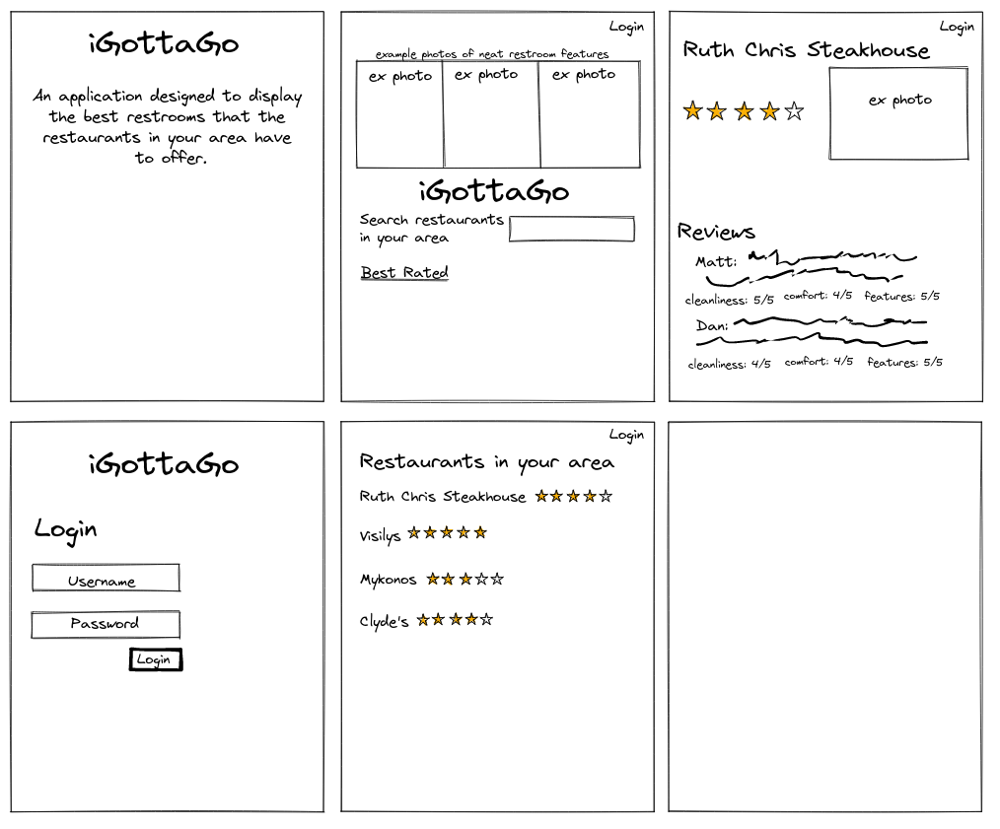
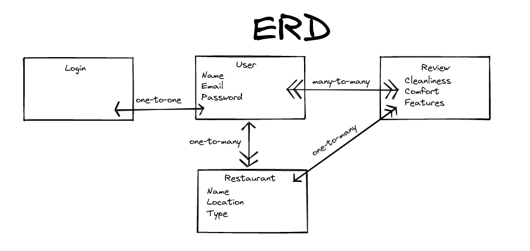

# `iGottaGo`

## Overview
This project's intention was to allow myself(student) to create an app with certain requirements:
- Use of an API
- A database with mutiple tables and relationships between them
- At least 2 GET routes
- At least 1 POST route
- At least 1 DELETE route
- At least 1 PUT route
- Securely hashed passwords using passport
- Site has basic functionality related to its goal
- Deployment (Heroku)

The idea behind this project was to make a `restaurant restroom rater`  for any public user, although a (free) account is required to use the browse the database, use the search API, and write reviews. The user-group in mind foodies that may find public restrooms uncomfortable, or people that find upscaled restrooms to be a curiousity. Using `iGottaGo`, users can share their opinions on restrooms in their area, helping eachother find more comfortable areas of relief where they are out to eat. The API can search many other types of public businessess, but iGottaGo is restraurant oriented for now.

## Ideation
Here is a simple `wireframe` of my idea of what the site could look like before the coding began:

<br>
I knew I wanted a review page to allow users to share their opinions/findings. I originally intended for there to be images for the restraunts, but the API provided some seemingly irrelevant images to a lot of the places, so I instead allowed the user to post images instead.

Here is my basic `Entity Relationship Diagram` to predict the relationships I'd need to connect the tables in my database:

<br>

## Implementation
Getting started, I used the [Yellow Pages API](https://rapidapi.com/dodocr7/api/yellow-page-us) from rapidapi. In order to populate the restaurant database, I pulled several datapoints from the API including the name, type of restaurant, address(address, street, state, and zip), hours of operation, and longitiude/latitude for an unfulfilled idea about displaying the location on a map using another API. I seeded my database with about 100 restraunts from the Los Angeles area to provide examples to any user that enters the app. Using relationships(hasMany -> belongsTo), I allowed the user to create reviews on each restaurant with another set of datapoints(user's name, cleanliness, notable features, comfort(1 to 5), and an image URL). I touched up the app with a greyscale style, unsure of what colors would suit an app about restrooms.

## Installation
If you are interested in installing this app on your own computer, follow these steps:

1. Fork & Clone the project from my [Github](https://github.com/Coreyimurphy91/iGottaGo).

2. In your IDE, open your terminal to locally bring in all the dependencies from the package.json. Type:
```text
npm install
```

3. Update your config.json to match your own user-settings.

4. Create a database to store the necessary tables:
```text
createdb igottago
```

5. Create the tables within the database, and then migrate:
```text
sequelize model:create --name Restaurant --attributes name:string,longitude:string,latitude:string,type:string,address:string,hours:string

sequelize model:create --name Review --attributes name:string,cleanliness:string,features:string,comfort:integer,restaurantId:string,userId:string

sequelize model:create --name User --attributes email:string,password:string

sequelize db:migrate
```

6. To seed your local database, use the provided seeder file and type:
```text
sequelize db:seed:all
```

7. Now, you will need to create a .env file with your own private data. This app uses the [Yellow Pages API](https://rapidapi.com/dodocr7/api/yellow-page-us), so go there and read over how it is used. Subscribe and get your own API key. Your .env also needs a secret session file, which you can give a space-less string to. Your file should look like this:
```text
APIKEY=(paste your api key from rapidapi here)
RAPIDHOST=yellow-page-us.p.rapidapi.com
SECRET_SESSION=TypeAnythingYouWantHere
```

`7.5` Make sure you include your new .env to your .gitignore if you plan to attach this to your own Github! Your .gitignore should look like this:
```text
.env
node_modules
package-lock.json
```

## Testing
Using node, test the app on your localhost(3000)!